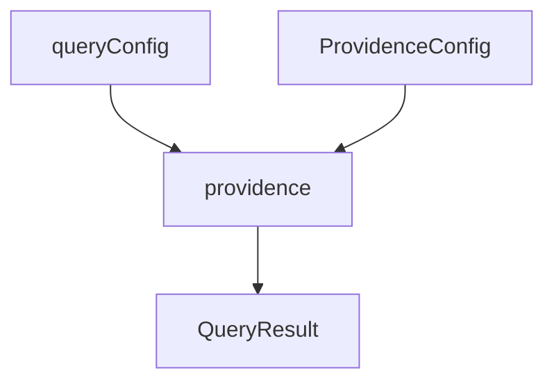
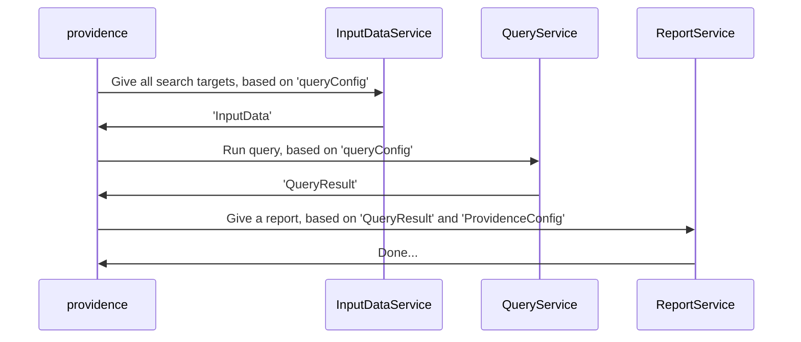

# Providence

Providence is the 'All Seeing Eye' that generates usage statistics by analyzing code.
It measures the effectivity and popularity of your software.
In just a few clicks you can measure the impact for (breaking) changes; making
your release process more stable and predictable.

## Setup

### Install providence

```sh
npm i --save-dev providence
```

### Add a providence script to package.json

```js
...
"scripts": {
    ...
    "providence": "providence analyze match-imports -r 'node_modules/lion-based-ui'",
}
```

> The example above illustrates how to run the "match-imports" analyzer for reference project 'lion-based-ui'. Note that it is possible to run other analyzers and configurations supported by providence as well. For a full overview of cli options, run `providence --help`. All supported analyzers will be viewed when running `providence analyze`

You are now ready to use providence in your project. All
data will be stored in json files in the folder `./providence-output`


## Setup: dashboard

### Add "providence:dashboard" script to package.json

```js
...
"scripts": {
    ...
    "providence:dashboard": "node node_modules/providence/dashboard/src/server.js"
}
```

### Add providence.conf.js

```js
const providenceConfig = {
  referenceCollections: {
    'lion-based-ui collection': ['./node_modules/lion-based-ui'],
  },
};

module.exports = providenceConfig;
```

Run `npm run providence:dashboard`


## Setup: about result output

All output files will be stored in `./providence-output`.
This means they will be committed to git, so your colleagues don't have to
rerun the analysis (for large projects with many dependencies this can be time consuming)
and can directly start the dashboard usage metrics.
Also, note that the files serve as cache (they are stored with hashes based on project version and analyzer configuration). This means that an interrupted analysis can be
resumed later on.

## Conceptual overview

Providence performs queries on one or more search targets.
These search targets consist of one or more software projects (javascript/html repositories)

The diagram below shows how `providenceMain` function can be used from an external context.



## Flow inside providence

The diagram below depicts the flow inside the `providenceMain` function.
It uses:

- InputDataService
  Used to create a data structure based on a folder (for instance the search target or
  the references root). The structure creates entries for every file, which get enriched with code,
  ast results, query results etc. Returns `InputData` object.
- QueryService
  Requires a `queryConfig` and `InputData` object. It will perform a query (grep search or ast analysis)
  and returns a `QueryResult`.
  It also contains helpers for the creation of a `queryConfig`
- ReportService
  The result gets outputted to the user. Currently, a log to the console and/or a dump to a json file
  are available as output formats.



## Queries

Providence requires a queries as input.
Queries are defined as objects and can be of two types:

- feature-query
- analyzer

A `queryConfig` is required as input to run the `providenceMain` function.
This object specifies the type of query and contains the relevant meta
information that will later be outputted in the `QueryResult` (the JSON object that
the `providenceMain` function returns.)

## Analyzer Query

Analyzers queries are also created via `queryConfig`s.

Analyzers can be described as predefined queries that use AST traversal.

Run:

```shell
providence analyze
```

Now you will get a list of all predefined analyzers:

- find-imports
- find-exports
- match-imports
- find-subclasses
- etc...


### Feature Query

Feature queries allow the user to define a query in the form of a string.
The format of this string resembles the css selector syntax.
The goal of a feature query is to do an html search in the code and detect feature usage
for a certain element(tag name).

A basic query would be:

```shell
providence q 'my-tag-name[attr-name]'
```

This will do an exact search on all `my-tag-name`s containing an attribute `attr-name`

The example below gives all occurences of tags beginninn with `my-tag` that have an attribute that
starts with 'attr' and an attribute value that starts with 'content'.

```shell
providence q 'my-tag*[attr*=content*]'
```

The example below gives back all elements that use a data attribute:

```shell
providence q '*[data-*]'
```

<!-- TODO: update image to new api -->


N.B. This image still uses the old api. Please use the api as depicted above.

## Running providence from its own repo

### How to add a new search target project

```sh
git submodule add <git-url> ./providence-input-data/search-targets/<project-name>
```

### How to add a reference project

By adding a reference project, you can automatically see how code in your reference project is
used across the search target projects.
Under the hood, this automatically creates a set of queries for you.

```sh
git submodule add <git-url> ./providence-input-data/references/<project-name>
```

### Updating submodules

Please run:

```sh
git submodule update --init --recursive
```

### Removing submodules

Please run:

```sh
sh ./rm-submodule.sh <path/to/submodule>
```
